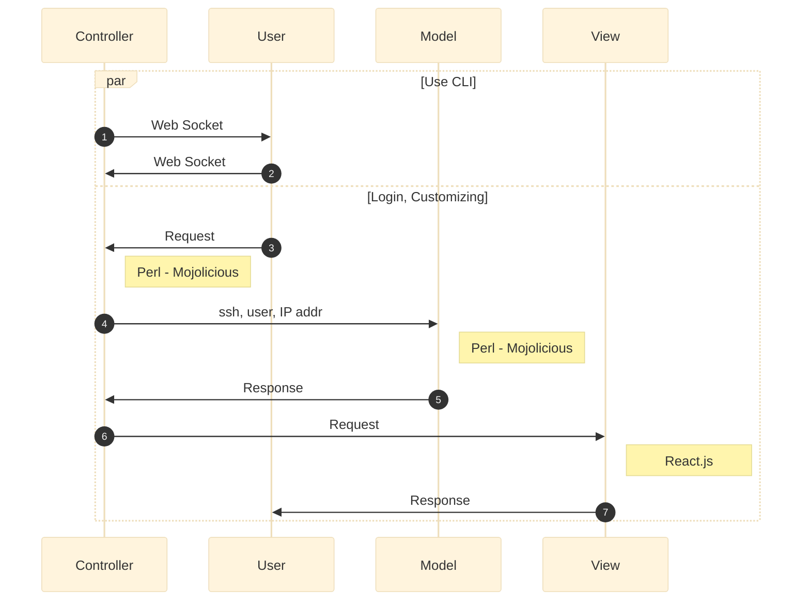

```mermaid
%%{init: {'securityLevel': 'loose', 'theme':'base'}}%%
        sequenceDiagram
          autonumber
          par Use CLI
            Controller->>User: Web Socket
            User->>Controller: Web Socket
          and Login, Customizing
            User->>Controller: Request
            Note right of Controller: Perl - Mojolicious
            Controller->>Model: ssh, user, IP addr
            Note right of Model: Perl - Mojolicious
            Model->>Controller: Response
            Controller->>View: Request
            Note right of View: React.js
            View->>User: Response

          end
```
